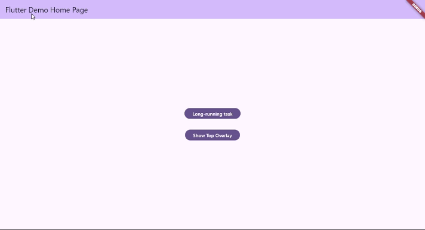
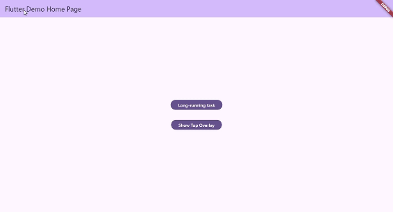

A flutter package for managing overlays. It separate your main UI and the overlays. It also solves some problems encountered when using Navigator.

Using `showDialog<T>` in Flutter introduces several challenges:

1. Route Management and Lifecycle Events:
    - Showing a dialog with `showDialog<T>` creates a new route, causing the current page route to go to the background. This can interfere with lifecycle event handling, especially when the app relies on `ModalRoute.of(context).isCurrent` to determine the active route.

2. Asynchronous Nature and Synchronization:
    - `showDialog<T>` is asynchronous, making it difficult to detect when a dialog is actually displayed. This complicates synchronization, particularly when multiple dialogs need to be managed rapidly in succession.
    
3. Navigator Confusion:
    - Dialogs and app pages share the same navigator and cannot be individually named. Using `Navigator.of(context).pop()` to close a dialog or a page can lead to confusion, as the behavior depends on the current navigator context.

## Installation

Add the following to your pubspec.yaml file:

```yaml
dependencies:
  flutter_overlay_manager: ^<latest_version>
```

## Initialization

To use the overlay manager, initialize it as a singleton:
```dart
FlutterOverlayManager overlayManager = FlutterOverlayManager.I;
```
Alternatively, you can create a new instance:

```dart
FlutterOverlayManager overlayManager = FlutterOverlayManager.asNewInstance();
```

When integrating this in a Flutter app, you would typically call this method in the MaterialApp builder:

```dart
MaterialApp(
  builder: (context, child) {
        return FlutterOverlayManager.I.builder((context) => child!);
  },  // Wraps the app to manage overlays
  home: YourHomePage(),
);
```
## Display a Custom Overlay

You can display any widget as an overlay:

```dart
overlayManager.show(
  (context) => YourCustomWidget(),
  backgroundColor: Colors.black54,
  dismissible: true,
);
```
## Show a Loading Indicator

There is a built-in loading overlay, you can use it to prevent the user from interacting with UI when calling API or long-running async task.

The manager ensures that only one loading overlay is dislayed when you call showLoading() anywhere and anytime: 

```dart
Loader loader = await overlayManager.showLoading();
```
To hide the loader, call:
```dart
loader.dismiss();
```
Or if you don't have a loader reference, use:

```dart
overlayManager.forceHideLoading();
```


## Register a Custom Loading View

To register a custom loading view globally:
```dart
overlayManager.registerLoadingView(
  (context) => CircularProgressIndicator(),
);
```

## Set Position for the Overlay

You can control the position of the overlay relative to other UI elements:

```dart
overlayManager.setPosition(
      OverlayPosition(
        overlayId: 'your_overlay_id',
        below: 'your_another_overlay_id',
      ),
    );
```
You can also get the ID of the overlay loading to set up the position for your overlays: 

```dart
overlayManager.loadingOverlayId
```

Here is an example for another overlay above the loading overlay: 



## Hiding an Overlay

To hide a specific overlay by its ID:

```dart
overlayManager.hide('your_overlay_id');
```

Or if you have a loader reference, use:

```dart
loader.dismiss();
```
## Example

```dart
import 'dart:math';

import 'package:flutter/material.dart';
import 'package:flutter_overlay_manager/flutter_overlay_manager.dart';

final _TOP_OVERLAY_ID = "TOP_OVERLAY_ID";

void main() {
  FlutterOverlayManager.I.setPosition(OverlayPosition(
      id: _TOP_OVERLAY_ID)); // The overlay with _TOP_OVERLAY_ID id is on top.

  final loadingOverlayID = FlutterOverlayManager.I.loadingOverlayId;
  FlutterOverlayManager.I.setPosition(OverlayPosition(
    id: loadingOverlayID,
    below: _TOP_OVERLAY_ID,
  )); // The overlay loading will be below the overlay with _TOP_OVERLAY_ID id.
  runApp(const MyApp());
}

class MyApp extends StatelessWidget {
  const MyApp({super.key});

  // This widget is the root of your application.
  @override
  Widget build(BuildContext context) {
    return MaterialApp(
      title: 'Flutter Demo',
      builder: (context, child) {
        return FlutterOverlayManager.I.builder((context) => child!);
      },
      theme: ThemeData(
        colorScheme: ColorScheme.fromSeed(seedColor: Colors.deepPurple),
        useMaterial3: true,
      ),
      home: const MyHomePage(title: 'Flutter Demo Home Page'),
    );
  }
}

class MyHomePage extends StatefulWidget {
  const MyHomePage({super.key, required this.title});

  final String title;

  @override
  State<MyHomePage> createState() => _MyHomePageState();
}

class _MyHomePageState extends State<MyHomePage> {
  @override
  Widget build(BuildContext context) {
    return Scaffold(
      appBar: AppBar(
        backgroundColor: Theme.of(context).colorScheme.inversePrimary,
        title: Text(widget.title),
      ),
      body: Center(
        child: Column(
          mainAxisAlignment: MainAxisAlignment.center,
          children: <Widget>[
            FilledButton(
              onPressed: () async {
                final loader = await FlutterOverlayManager.I.showLoading();
                await Future.delayed(Duration(seconds: 5));
                await loader.dismiss();
              },
              child: Text("Long-running task"),
            ),
            const SizedBox(height: 32),
            FilledButton(
              onPressed: () {
                if (FlutterOverlayManager.I.isOverlayShowing(_TOP_OVERLAY_ID)) {
                  FlutterOverlayManager.I.hide(_TOP_OVERLAY_ID);
                } else {
                  FlutterOverlayManager.I.show(
                    (context) => const Positioned(
                      top: 200,
                      right: 0,
                      child: TopOverlayView(),
                    ),
                    id: _TOP_OVERLAY_ID,
                  );
                }
                setState(() {});
              },
              child: Text(
                  FlutterOverlayManager.I.isOverlayShowing(_TOP_OVERLAY_ID)
                      ? "Hide Top Overlay"
                      : "Show Top Overlay"),
            ),
          ],
        ),
      ),
    );
  }
}

class TopOverlayView extends StatefulWidget {
  const TopOverlayView({super.key});

  @override
  State<TopOverlayView> createState() => _TopOverlayViewState();
}

class _TopOverlayViewState extends State<TopOverlayView> {
  var _color = Colors.yellow;
  void _randomColor() {
    final random = Random();
    _color = Colors.primaries[random.nextInt(Colors.primaries.length)];

    setState(() {});
  }

  @override
  Widget build(BuildContext context) {
    return Column(
      mainAxisSize: MainAxisSize.min,
      children: [
        Container(
          color: _color,
          width: 50,
          height: 50,
        ),
        const SizedBox(height: 16),
        FilledButton(
          onPressed: () {
            _randomColor();
          },
          child: Text("Click to change color"),
        ),
      ],
    );
  }
}

```
## Contributions

Contributions are welcome! Feel free to open issues or submit pull requests on the GitHub repository.